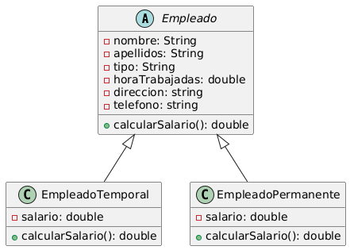

# AcademiaAfirma

## Caso:
> Una empresa necesita un sistema para gestionar sus empleados. Los empleados pueden ser de tipo Permanente o Temporal, y cada tipo tiene un salario que se calcula de manera diferente:
>
> Los empleados permanentes tienen un salario fijo mensual.
>
> Los empleados temporales tienen un salario por hora trabajada.

## diagrama de clases 

## Explica cómo el principio de Responsabilidad Única (SRP) aplica al caso anterior
> En el caso anterior, el principio de Responsabilidad Única se aplica de la siguiente manera:
> 
> la clase Empleado tiene una sola responsabilidad que es la de representar a un empleado, la clase EmpleadoPermanente solo tiene la responsabilidad de calcular el salario para un empleado permanente y asu vez la clase EmpleadoTemporal tiene solo la responsabilidad de calcular el salario para el empleado temporal, por lo tanto se cumple con el principio de responsabilidad unica ya que nuestras clases cumplen con una sola responsabilidad.
